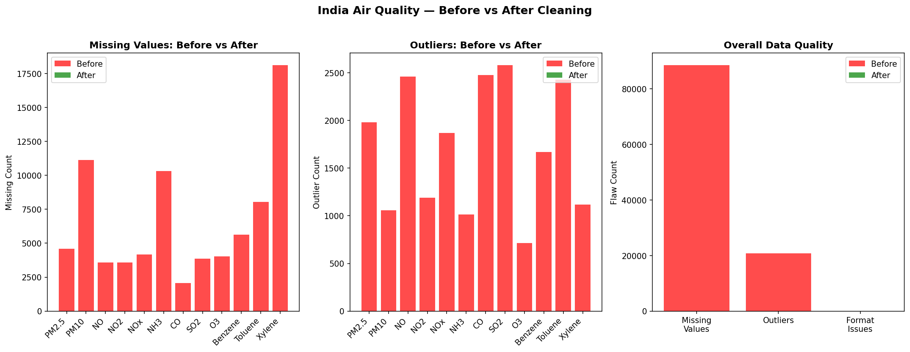

# 🔍 Data Flaw Hunter & Auto-Cleaner

A full pipeline that automatically detects and fixes real data flaws in India's Air Quality dataset using ML-powered techniques.

## 🚀 Live Demo
**API:** https://web-production-323c0.up.railway.app/docs

## 📊 Real Flaws Found
| Flaw Type | Column | Severity |
|---|---|---|
| Missing Values | Xylene | 🔴 CRITICAL (61%) |
| Missing Values | PM10 | 🔴 CRITICAL (38%) |
| Missing Values | NH3 | 🔴 CRITICAL (35%) |
| Outliers | SO2 | 2,578 bad readings |
| Outliers | CO | 2,475 bad readings |
| Format | Date | Stored as string |

## ✅ Before vs After
| Metric | Before | After |
|---|---|---|
| Missing cells | 88,488 | 0 |
| Outliers | 20,853 | 0 |
| Format issues | 1 | 0 |
| Rows lost | — | 0 |

## 🛠️ Tech Stack
- **Pandas** — data operations
- **Scikit-learn** — KNN Imputation
- **FastAPI** — REST API
- **Railway** — deployment

## 🔧 How It Works
1. Scans dataset for missing values, outliers, duplicates, format issues
2. Fixes missing values using KNN Imputation (ML)
3. Caps outliers using Winsorization
4. Standardizes formats
5. Generates Before vs After proof report
6. Exposes everything as a live API

## 📈 API Endpoints
- `GET /` — health check
- `POST /api/analyze` — upload any CSV, get flaw report
- `GET /api/summary` — before vs after stats

## 🖼️ Before vs After
